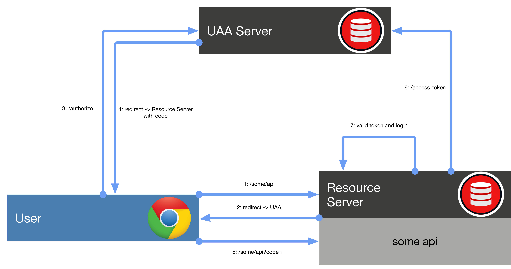

[](https://www.apache.org/licenses/LICENSE-2.0.html)
[](https://maven-badges.herokuapp.com/maven-central/com.github.xfslove/shiro-uaa)

# shiro-uaa


A lightweight User Account and Authentication (UAA) Server base on Shiro.

### 来源

当刚开始一个项目时，相信Shiro的简便会成为大多数开发者权限框架的首选，但当项目扩展后，从1到n，并且需要统一认证和授权时，Shiro本身并不支持统一认证和授权成为了限制，Shiro有CasFilter，但是CAS又是另外一套框架，较为重，为了能使认证授权服务更简单，轻量，易用，所以有了Shiro-UAA

### 为什么用 shiro-uaa

- 轻量 UAA Server
- 纯粹的 Shiro
- 学习简单
- 容易扩展
- 开箱即用

#### 认证授权流程




#### 说明

- auth-server

  ##### maven

  ```
  <dependency>
      <groupId>com.github.xfslove</groupId>
      <artifactId>shiro-uaa-auth-server</artifactId>
      <version>1.0.0</version>
  </dependency>
  ```

  ##### 内置endpoint

  | URI地址                     | 说明                                  |
  | --------------------------- | ------------------------------------- |
  | /uaa-auth/authorize         | 请求授权的地址，会定向到你的登录页    |
  | /uaa-auth/authorzie/apporve | 同意授权，分发code地址                |
  | /uaa-auth/access-token      | Resource Server获取access-token的地址 |
  | /uaa-auth/logout            | 从UAA登出的地址                       |

  ##### 可扩展api

  | 接口名              | 说明             |
  | ------------------- | ---------------- |
  | AccessClientService | 接入系统服务     |
  | AccessTokenService  | access-token服务 |
  | AccountService      | 用户服务         |
  | AuthCodeService     | code服务         |
  | RoleService         | 角色服务         |

  ##### login

  自定义Login页面和登录验证，implement `org.apache.shiro.authc.credential.CredentialsMatcher` ，实现登录时的校验逻辑，配置`shiro.loginUrl`

  ##### 扩展的配置参数

  | 参数名                                  | 说明                                                         |
  | --------------------------------------- | ------------------------------------------------------------ |
  | shiro.uaa.server.codeExpires            | UAA分发Code过期时间，单位为秒                                |
  | shiro.uaa.server.accessTokenExpires     | UAA分发AccessToken过期时间，单位为秒                         |
  | shiro.uaa.server.refreshTokenExpires    | UAA分发RefreshToken过期时间，单位为秒                        |
  | shiro.loginUrl                          | 自定义的登录地址                                             |
  | shiro.uaa.server.clients[].name         | 接入应用名称，使用默认内存AccessClientService时有效          |
  | shiro.uaa.server.clients[].clientId     | 接入应用clientId，使用默认内存AccessClientService时有效      |
  | shiro.uaa.server.clients[].clientSecret | 接入应用clientSecret，使用默认内存AccessClientService时有效  |
  | shiro.uaa.server.roles[].name           | 角色名称，对应Shiro的Role，使用默认内存RoleService时有效     |
  | shiro.uaa.server.roles[].permCodes[]    | 角色权限，对应Shiro的Permission，使用默认内存RoleService时有效 |
  | shiro.uaa.server.roles[].clientId       | 角色所属应用，使用默认内存RoleService时有效                  |
  | shiro.uaa.server.accounts[].username    | 账号登录名，使用默认内存AccountService时有效                 |
  | shiro.uaa.server.accounts[].password    | 账号密码，使用默认内存AccountService时有效                   |
  | shiro.uaa.server.accounts[].roles[]     | 账号拥有角色，使用默认内存AccountService时有效               |

  

- resource-server

  ##### maven

  ```
  <dependency>
      <groupId>com.github.xfslove</groupId>
      <artifactId>shiro-uaa-resource-server</artifactId>
      <version>1.0.0</version>
  </dependency>
  ```

  ##### filterChainDefinition

  implement `CustomFilterChainDefinition` ，定义不同的path经过不同的Filter

  ##### logout

  先从Resource Server登出，再从UAA登出，配置`shiro.logoutUrl`参数加载`LogoutEndpoint`

  ##### 注解

  和Shiro一样

  | 注解名                  |
  | ----------------------- |
  | @RequiresRoles          |
  | @RequiresPermissions    |
  | @RequiresUser           |
  | @RequiresAuthentication |
  | @RequiresGuest          |

  ##### 扩展的配置参数

  | 参数名                               | 说明                    |
  | ------------------------------------ | ----------------------- |
  | shiro.uaa.resource.serverScheme      | UAA地址的Scheme         |
  | shiro.uaa.resource.serverHost        | UAA地址的Host           |
  | shiro.uaa.resource.serverPort        | UAA地址的Port           |
  | shiro.uaa.resource.serverContextPath | UAA地址的ContextPath    |
  | shiro.uaa.resource.clientId          | UAA分配的ClientId       |
  | shiro.uaa.resource.clientSecret      | UAA分配的ClientSecret   |
  | shiro.logoutUrl                      | Resource Server登出地址 |

#### Requires

*jdk1.7+ and spring boot*

#### TODO

- 提供auth-server可部署服务

#### 例子

[**shiro-uaa-samples**](https://github.com/xfslove/shiro-uaa-samples)

#### Lincense

[*Apache 2.0 license*](license).


